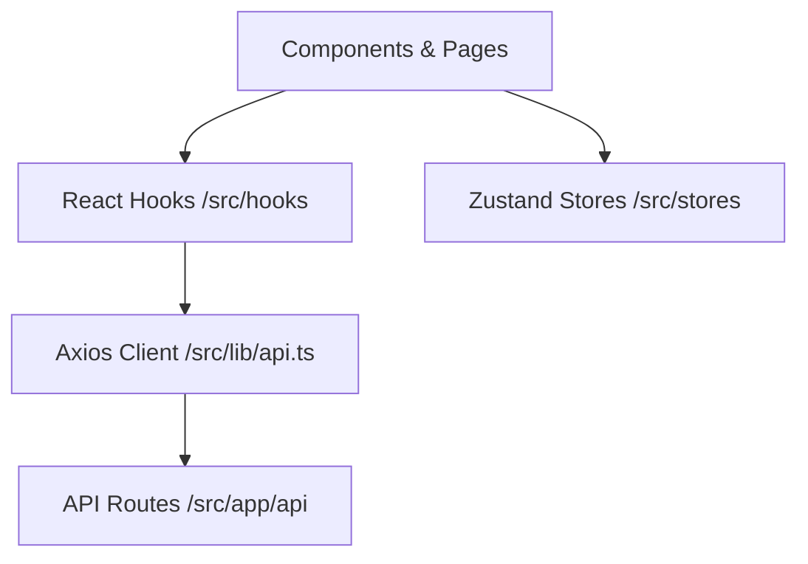

# Necty - Code Structure and Conventions

This document outlines the architecture, coding patterns, and standards used throughout the Necty application.

---

## 1. Core Architecture Pattern
Our client-side architecture follows a clean separation of concerns:


---

## 2. API Calling Layer

### A. Raw Client Definition (`/src/lib/api.ts`)
- All backend requests use a pre-configured `axios` client instance `apiClient` targeting `/api`.
- API endpoints are organized under namespace exports (e.g., `authApi`, `onboardingApi`, `billingApi`).
- All payload and response bodies are strictly typed (e.g., `SignupPayload`, `MessageResponse`).
- Error messages are extracted and normalized to ensure user-friendly error messages are propagated.

### B. API Hooks Wrapper (`/src/hooks/`)
- Components **never** call the API client directly. Instead, they use wrapper hooks (e.g., `useAuthApi`, `useOnboardingApi`).
- Every endpoint call is wrapped in `useCallback` to prevent unnecessary component re-renders.
- Example structure of an API hook:
```typescript
import { useCallback } from "react";
import { authApi, type LoginPayload } from "@/lib/api";

export function useAuthApi() {
  const login = useCallback((payload: LoginPayload) => authApi.login(payload), []);
  return { login };
}
```

---

## 3. State Management

### A. Zustand Stores (`/src/stores/`)
- Global state, multi-step forms, and cached local states are managed using **Zustand**.
- Persisted stores use the `persist` middleware with `createJSONStorage` pointing to `localStorage` (e.g., `onboardingStore.ts`).

### B. SSR-Safe Hydration Check
When using persisted stores under Next.js (which does Server-Side Rendering/Prerendering), `localStorage` is not available on the server.
- **Rule:** Never check or call `useOnboardingStore.persist` operations directly during the initial render or in module scope.
- **Rule:** Initialize `hydrated` state to `false`, and manage rehydration safely within `useEffect`:
```typescript
const [hydrated, setHydrated] = React.useState(false);

React.useEffect(() => {
  // Check if store has already hydrated on client mount
  if (useOnboardingStore.persist?.hasHydrated()) {
    setHydrated(true);
  }
  
  // Set up finish handler
  const unsubscribe = useOnboardingStore.persist?.onFinishHydration(() => {
    setHydrated(true);
  });
  
  return () => unsubscribe?.();
}, []);
```

---

## 4. Directory Layout

- `/src/app`: Page routing structure (using Next.js App Router).
  - `/src/app/api`: Server-side Route Handlers (`route.ts`).
- `/src/components`: UI components, organized by domain (e.g., `components/onboarding`, `components/ui`).
- `/src/hooks`: Custom React hooks, including API call abstractions.
- `/src/lib`: Core utility files (e.g., Supabase client/server initializers, helper utilities, and `api.ts`).
- `/src/stores`: Zustand state stores.
- `/src/types`: Global TypeScript declarations and interfaces.
